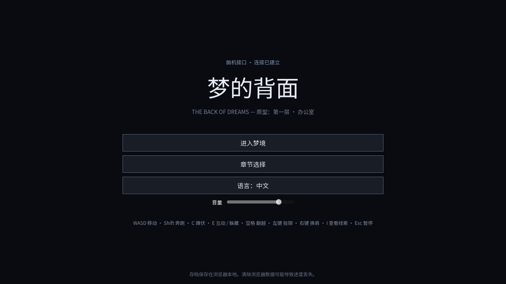
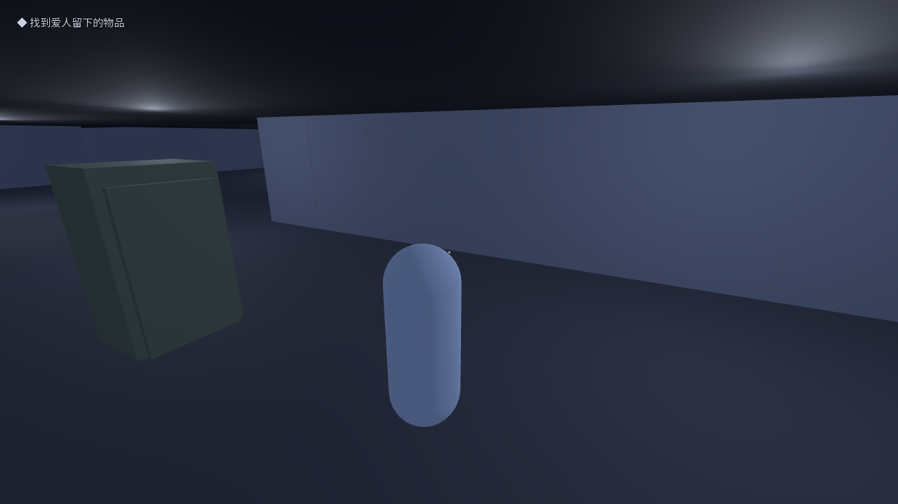

# 梦的背面 The Back of Dreams — 可玩原型（第一层 · 办公室）

第三人称 3D 心理悬疑潜行游戏《梦的背面》的首个可玩垂直切片，对应 PRD §13：
只包含「办公室——疏离」一关，使用基础几何体灰盒、程序化生成的占位音效与运行时
构建的场景，验证核心玩法循环。




## 已验证的内容（PRD §13 / §15）

- 第三人称移动手感：行走 / 短距离奔跑（体力）/ 蹲伏 / 换肩观察 / 翻越矮隔断
- 柜子与桌底两类离散藏身点；高风险藏身点带有明确环境提示（门半开 + 地面磨损）
- 拾取并投掷订书机制造声响诱导敌人
- 无脸主管七状态 AI：巡逻 → 怀疑 → 调查 → 发现 → 追逐 → 紧张搜索 → 平静
  （网格 A* 寻路；视锥 + 射线遮挡视觉；半径衰减听觉；紧张状态下强化并检查藏身点）
- 主管特殊规则：优先调查亮着的显示器、突然停转的打印机（PRD §7 第一关）
- 三阶段梦境异化：灯光衰减闪烁 → 通道封闭（x）→ 空间重组（y 封闭 / o 打开捷径），
  以环境状态而非倒计时表达剩余时间；第四阶段强制弹出失败
- 物品检查：可旋转查看的破损咖啡杯，翻转杯底发现树叶与日期 10·17
- 轻量谜题链：咖啡杯 → 日期 → 启动 1017 号工位 → 电梯供电 → 抵达电梯通关
- 失败与重试：被抓 / 梦境崩塌后从关卡开头重来，开场演出可跳过
- 中 / 英双语（数据驱动 JSON 本地化，两种语言间有符合 PRD §8 的细微措辞差异）
- 浏览器本地存档（章节完成状态、语言、音量）
- Web 导出（无线程 WebGL 2 兼容模式）在无 GPU 的 Chromium 中实测可运行

## 操作

| 按键 | 动作 |
| --- | --- |
| WASD / 方向键 | 移动 |
| Shift | 奔跑（消耗体力） |
| C / Ctrl | 蹲伏切换 |
| E | 互动 / 进出藏身点 |
| 空格 | 翻越矮隔断 |
| 鼠标左键 | 投掷手中物品 |
| 鼠标右键 | 换肩观察 |
| I / Tab | 查看已获得的线索 |
| Esc / P | 暂停 |

## 在编辑器中运行

1. 安装 [Godot 4.3+（标准版）](https://godotengine.org/download)
2. 用 Godot 打开本目录的 `project.godot`
3. 按 F5 运行

## Web 导出

项目已含 `export_presets.cfg`（Web 预设，关闭线程支持，无需跨源隔离头）：

```sh
godot --headless --path . --export-release "Web" build/web/index.html
# 本地试玩：
python3 -m http.server 8000 --directory build/web
```

macOS 原生导出属于后续阶段（PRD §14 第 10 步），在编辑器中添加 macOS 预设即可。

## 无头冒烟测试

CI 可直接在无显示环境验证整个玩法链路（关卡构建、寻路、谜题、抓捕、崩塌时间轴、
射线交互、双语文案齐全性），失败时退出码非零：

```sh
godot --headless --path . -- smoke
```

## 结构

```
project.godot           工程配置（Compatibility 渲染，适配 WebGL 2）
data/levels/office.json 办公室关卡：ASCII 地图 + 敌人参数 + 崩塌时间轴（数据驱动）
data/locale/{zh,en}.json 全部文案
scripts/autoload/       Loc（本地化）/ AudioSynth（程序化音效）/ Game（输入、存档、噪音事件总线）
scripts/level/          从 ASCII 地图运行时构建整个灰盒关卡 + 梦境崩塌系统
scripts/player/         第三人称控制器
scripts/enemy/          无脸主管状态机
scripts/objects/        藏身点 / 投掷物 / 工位 / 关键物品
scripts/ui/             HUD（极简：提示、目标、警觉反馈、紧张红晕）
scripts/main.gd         标题 / 暂停 / 物品检查 / 结算流程 + 冒烟测试
assets/fonts/           Noto Sans SC 子集（仅含用到的字形，OFL 许可）
```

地图为字符网格：`#` 墙 · `v` 可翻越隔断 · `M/U/d` 工位（M 带显示器、U 可躲桌下）·
`C` 柜子 · `K` 关键物品 · `T` 投掷物 · `e/E` 电梯 · `1-8` 巡逻点 · `P/G` 出生点 ·
`x/y` 二 / 三阶段封闭 · `o` 三阶段打开的捷径。改地图即改关卡。

## 后续（超出本原型范围）

其余六关的正式资产、人物动画、配音、完整美术升级与 macOS 打包见 PRD §13/§14。
